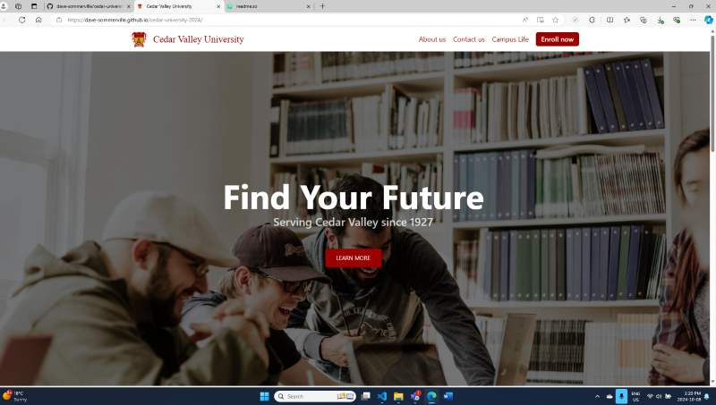
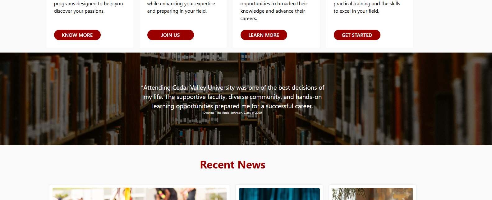

# Cedar University

University Webpage Design Project
This project is a demonstration of a fabricated university's webpage, 
created as part of a group exercise for my course at MITT. The focus 
was on building a responsive design while incorporating various web 
components and formatting techniques.

Please refer to the acknowledgments section for details on my project partners.

Note: As I am currently managing several 
other projects, this webapp is a work in progress.  Further adjustments 
and expansions to the design will be implemented in the near future.

## Authors

- [@myles-reid](https://www.github.com/myles-reid)
- [@samuelReutcky](https://www.github.com/myles-reid)
- [@mrshauaibu](https://github.com/mrshuaibu)

## Tech Stack

**Using**
- HTML
- CSS
- (Intending to add JavaScript)

## Screenshots
In initial development, banner design was my main focus

## Features
- Header and footer navigation menus
- Landing page, About Us page, and Contact Us page
- Fully responsive design
- Hero banner  with call to action button and middle banner with fixed background 
- Two multiple column sections
## Badges

